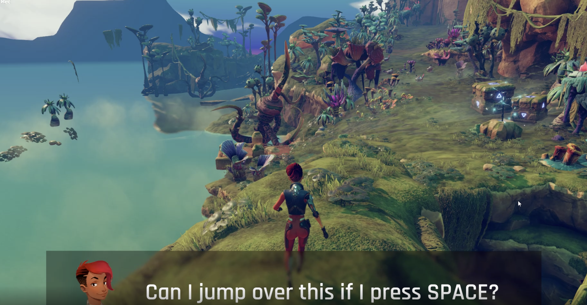
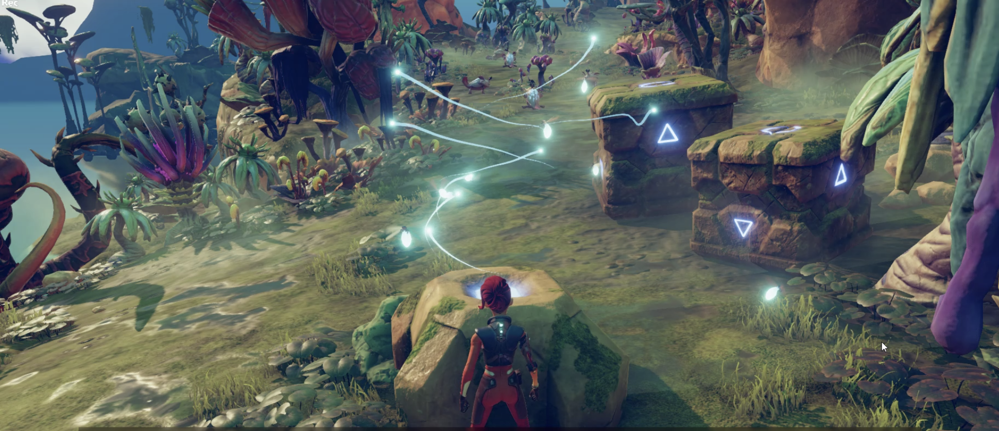
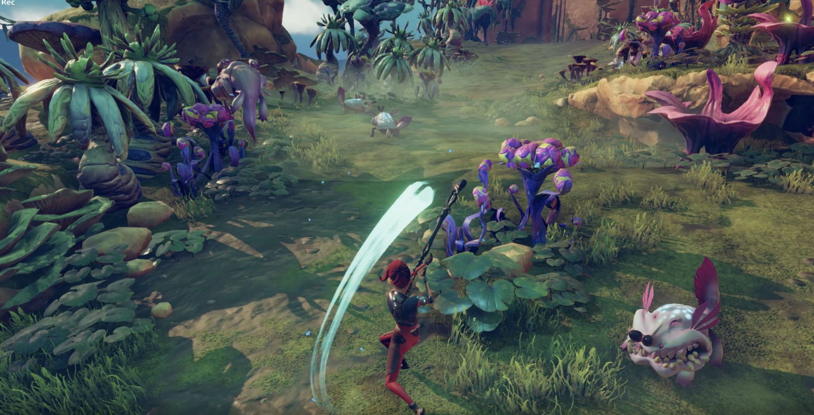

# Import and Play a normal mobile game to AR/VR 

The Mobile Game Importer for AR/VR is an innovative project that bridges the gap between traditional mobile gaming and immersive augmented reality (AR) or virtual reality (VR) experiences. This tool enables users to import and play their favorite mobile games in AR or VR environments, providing an enhanced and immersive gaming experience.

Key Features:
Game Compatibility: Import a variety of popular mobile games into AR/VR environments seamlessly.

Immersive Environments: Experience your favorite games in fully immersive AR or VR settings, enhancing gameplay and engagement.

Customization: Tailor the gaming environment to your preferences, adjusting settings for optimal AR/VR experiences.

Interactivity: Leverage AR/VR capabilities for enhanced interactivity within the game, offering new possibilities for gameplay mechanics.

Cross-Platform Support: Ensure compatibility with major mobile games, creating a bridge between traditional gaming and emerging AR/VR technologies.

How It Works:
Game Selection: Choose a supported mobile game from a list of compatible titles.

Import: Use the Mobile Game Importer to seamlessly import the selected game into the AR/VR environment.

Play in AR/VR: Immerse yourself in the game, experiencing it in a whole new dimension with AR or VR devices.

Customization: Adjust settings and configurations to optimize the gaming experience for AR/VR.

Use Cases:
Social Gaming: Play mobile games with friends in a shared AR/VR space.

Enhanced Gameplay: Experience mobile games in a more immersive and interactive manner.

Cross-Reality Experiences: Bridge the gap between the virtual and physical worlds, creating unique gaming experiences.

Training Simulations: Utilize AR/VR for serious gaming applications, turning traditional mobile games into training simulations.

The Mobile Game Importer for AR/VR opens up new possibilities for gaming enthusiasts, bringing a new layer of excitement to their favorite titles by merging them with cutting-edge AR/VR technologies. Whether you're a casual gamer or an AR/VR enthusiast, this project aims to redefine the way we play and experience mobile games.
